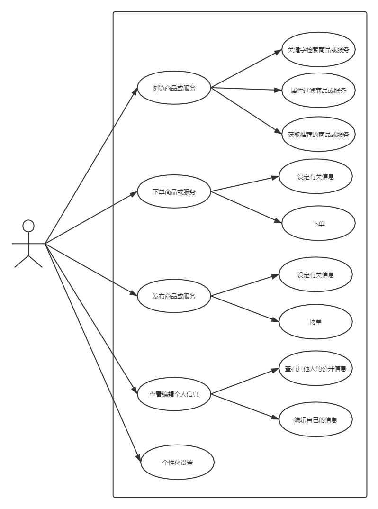
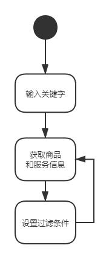
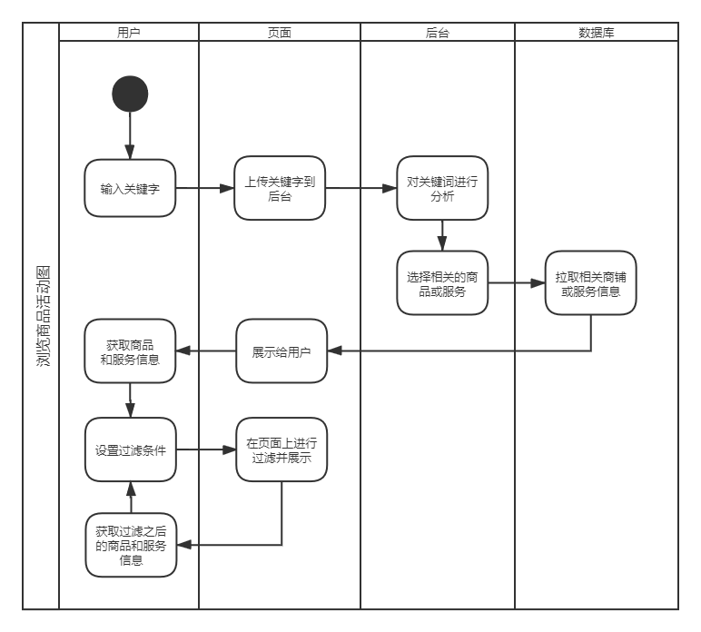
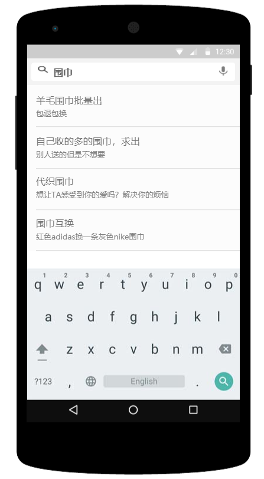

# 页面逻辑子系统设计文档

大学生在线交易平台

## 用例图

## 浏览商品或服务

用户可以打开应用，自主浏览由其他用户发布的二手商品或服务。

用户在首页可以浏览系统根据其喜好智能推荐的商品或者服务。

用户可以通过关键词搜索寻找自己需要的二手商品或服务。

用户可以对搜索结果进行条件过滤。

## 下单商品或服务

在进入到一个商品或服务的详细页面之后，可以将其加入至购物车或者直接下单。

下单时填写好相应的订单地址和商品信息，之后送到卖家手中提醒卖家发货或提供服务。

## 发布商品或服务

用户可以发布自己的商品或者提供自己的服务，发布之后，其他用户经过搜索或者在推荐当中应该能够浏览此商品或服务。

## 查看和编辑个人信息

用户可以查看并编辑自己的个人信息，并且决定哪些信息可以公开而哪些信息是私密的。

用户可以查看其他用户的公开信息。

## 个性化设置

用户可以对软件的界面进行个性化设置，例如设置外观颜色，皮肤等等。

用户的个人设置可以作为一部分个人信息上传到服务器并且在各个用户端之间同步。

# 设计文档

## 技术选型
计划采用Django 开发后端服务器，前端采用基于Vue.js 框架的Uniapp实现，以实现全平台通用访问。安卓和iOS平台选用套壳浏览器app的方式实现统一开发。

## 表单设计以及接口设计

### 用户信息表

| id             | email    | name | tel  | pwd |  用户公开信息|用户隐私信息|开发信息|token信息|
| -------- | ----- | --- | --- | ---- | ------- | ------- | ------- | -------- |
| 用户的id，自增主键 | 用户邮箱 |  用户昵称 | 用户手机号码  | 用户密码（哈希之后存储） | 用户公开信息的json串 |用户隐私信息的json串|备注信息|登录之后用户的身份标识|

提供接口：

| 接口名 | 接口功能描述 | 接口获取信息 | 接口传回信息 |
| ---- | ---- | ---- | ---- |
| 登录接口 | 验证登录用户的身份，提供身份token标识。 | 登陆凭证（email、telephone等）、和密码 | 返回登录状态以及，若成功则返回当前用户信息和session token |
| 查询接口 | 查询用户信息 | 查询目标用户的id和查询者的token | 验证权限后传回相应的信息 |
| 编辑信息接口 | 更改编辑用户信息 | 更改信息目标用户和更改者的token | 验证身份后更改用户信息 |

### 商品表

| id               | name     | description | seller           | storage  | 备注     |
| ---------------- | -------- | ----------- | ---------------- | -------- | -------- |
| 商品自增id，主键 | 商品名称 | 商品描述    | 外键，商品的卖家 | 商品库存 | 备注信息 |

提供接口

| 接口名       | 接口功能描述     | 接口获取信息                | 接口传回信息                 |
| ------------ | ---------------- | --------------------------- | ---------------------------- |
| 查询接口     | 查询商品的信息   | 商品id                      | 返回商品信息                 |
| 新增商品接口 | 新增一个商品     | token和商品信息             | 验证用户权限后增加新的商品   |
| 编辑信息接口 | 更改编辑商品信息 | token和商品id和新的商品信息 | 验证用户权限后更改商品的信息 |
|              |                  |                             |                              |

## 对接订单系统

给订单系统提供查询和更改商品以及用户信息的接口

